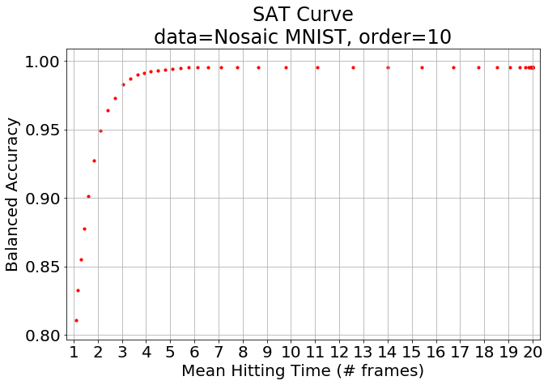
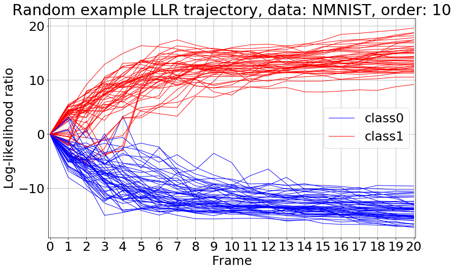

# SPRT-TANDEM
This repository contains the SPRT-TANDEM model proposed in "Deep Neural Networks for the Sequential Probability Ratio Test on Non-i.i.d. Data Series" to perform early classification of time-series. The SPRT-TANDEM sequentially estimates log-likelihood ratios of two hypotheses, or classes, for fast and accurate sequential data classification.

## Requirements
- Python 3.5
- TensorFlow 2.0.0
- CUDA 10.0
- cuDNN 7.6.0
- (For reproduction: Jupyter Notebook)

## Reproduction and Quick Trial
1. Make Nosaic MNIST (`make_nmnist.py`): Modify user-defined parameters and `python make_nmnist.py`.
2. Save bottleneck features of Nosaic MNIST (`save_featureTFR_nmnist.ipynb`): Modify user-defined parameters and run all the cells.
3. Plot the speed-accuracy tradeoff (SAT) curve (`plot_SAT_curve.ipynb`): Modify user-defined parameters and run all the cells.

(Cannot open the images in Anonymous Github)



## Files and Directories
- `train_fe_nmnist.py`
  - training script for feature extractor (ResNet) on Nosaic MNIST
  - Modiry `config_fe.yaml` as you see fit and `python train_fe_nmnist.py` in `/SPRT-TANDEM`.
- `train_ti_nmnist.py`
  - training script for temporal integrator (LSTM) on Nosaic MNIST
  - Modiry `config_ti.yaml` as you see fit and `python train_ti_nmnist.py` in `/SPRT-TANDEM`.

- `demo_nmnist.ipynb`
  - Nosaic MNIST is like this. Have a look!

- `make_nmnist.py`
  - for reproduction
  - __You can easily make Nosaic MNIST dataset.__
- `save_featureTFR_nmnist.ipynb`
  - for reproduction
  - extracts bottleneck features and save them to TFRecords
- `plot_SAT_curve.ipynb`
  - for reproduction
  - draws the speed-accuracy tradeoff (SAT) curve and log-likelihood ratio trajectories of a model
- `example_ckpts/`
  - for reproduction and quick trial
  - Our trained models, namely, ResNet and two LSTMs, are here.
- `data-directory/`
  - Nosaic MNIST will be saved here by default parameters of `make_nmnist.py`.

- `configs/config_fe_nmnist.yaml`
  - config fiel for `train_fe_nmnist.py`
- `configs/config_ti_nmnist.yaml`
  - config file for `train_ti_nmnist.py`

- `datasets/data_processing.py`
  - data loader and data processing functions

- `models/backbones_fe.py`
  - ResNet v1 and v2 models
- `models/backbones_ti.py`
  - LSTM model
- `models/losses.py`
  - loss functions and gradient computation. 
  - ___LLLR is in `binary_llr_loss_func`.___
- `models/optimizers.py`
  - optimizer switching function

- `utils/misc.py`
  - miscellaneous minor functions
- `utils/performance_metrics.py`
  - performance metrics such as balanced accuracy 
  - ___the SPRT algorithm is in `binary_truncated_sprt`.___
- `utils/util_ckpt.py`
  - utility functions to save checkpoints (models)
- `utils/util_optuna.py`
  - utility functions for Optuna
- `utils/util_tensorboard.py`
  - TensorBoard logger class

## Nosaic MNIST Example
(Cannot open the image in Anonymous Github)


## Citation
___Please cite our paper and this page if you use the whole or a part of our codes.___
```
Bibtex:

@article{XXX
  XXX
}
@misc{XXX
  XXX
}
```

## Anonymous Github
https://anonymous.4open.science/r/8e802b42-ec6f-4545-b34e-fb320cba4c4d/#home


